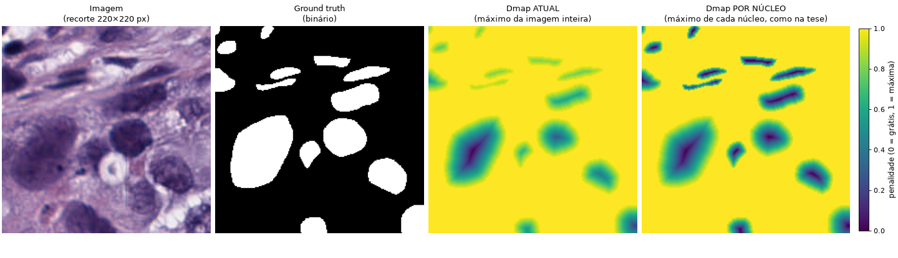

# 04 — Funções de perda

> Legenda: ✅ verificado no código ou medido · 📜 histórico/commits · 📖 tese/artigo · ❓ a confirmar.
> Problemas ficam em [08-pendencias.md](08-pendencias.md) e são citados pelo ID.
>
> Última verificação: 2026-09-27 (commit `f9b1e9b`). Substitui o antigo `src/losses/README.md` (removido; recuperável com
> `git show f9b1e9b:src/losses/README.md`).

---

## 1. Resumo

- A loss total é uma **soma de termos** montada no notebook: `LossComposer([DiceTerm(), RMSETerm(), SizeTerm(0.02), ...])`.
  Cada termo carrega o **próprio peso**. ✅
- Os termos se dividem em dois grupos:
  - os que olham a **segmentação final** (saída do ScribblePrompt): Dice e RMSE;
  - os que olham os **marcadores** (saída da MarkerUNet): Size, DMap, TV, Border e NotTooThin. ✅
- Da tese vêm L_seg (soft Dice), L_size, L_Dmap e L_TV, com as mesmas fórmulas. O L_comp foi removido de propósito.
  Border, NotTooThin e RMSE vieram do orientador. 📖✅
- Diferenças que importam em relação à tese:
  - o mapa de distância é normalizado **por imagem**, não por objeto (PD-06);
  - Size, DMap e TV são normalizados pelo **batch inteiro** (PD-12);
  - o `BorderTerm` pune marcadores sobre **16–17% dos pixels de núcleo real** (PD-41, nova).
- **O conflito central** ([03-modelos.md §8](03-modelos.md)): com o ScribblePrompt como camada de segmentação, o Dice só fica
  bom com marcadores do tamanho do núcleo inteiro, enquanto o Size (e o DMap) puxam o marcador para ficar pequeno. Na tese, esse
  conflito não existe, porque o FMBS expande marcadores pequenos.

---

## 2. Como os termos se combinam ✅

### 2.1 Padrão Strategy — [loss_term.py](../../src/losses/loss_term.py), [terms.py](../../src/losses/terms.py), [loss_composer.py](../../src/losses/loss_composer.py)

```python
class LossTerm(nn.Module, ABC):          # contrato de cada termo
    name: str                            # chave no log ("dice", "size", ...)
    def compute(self, ctx) -> Tensor     # lê do ctx só o que precisa

class LossComposer(nn.Module):
    def forward(self, prediction, distance_maps, gt_masks, markers=None):
        ctx = {"prediction": prediction,                                  # segmentação final (ScribblePrompt)
               "markers": markers if markers is not None else prediction, # saída da MarkerUNet
               "distance_maps": distance_maps, "gt_masks": gt_masks}
        log = {t.name: t(ctx) for t in self._terms}
        return sum(log.values()), log                                     # total = soma simples
```

- **Por que assim** 📜 (antigo `jornal.md`, 04/05): antes, a combinação de losses "estava presa no código-fonte"
  (`MultiRegularization(size=..., tv=..., ...)`). Com o Strategy, cada experimento **monta a lista de fora**, sem tocar no `src/`.
- **Onde fica o peso:** dentro de cada termo (`SizeTerm(weight=0.02)` repassa o peso para `ObjectSizeLoss`). O composer só
  soma. Os valores logados **já vêm multiplicados pelo peso**, e a soma do log é igual à loss total.
- **Quem chama:** o `Trainer._compute_loss` ([trainer.py:220-242](../../src/training/trainer.py#L220-L242)) pega
  `data["segmentation"]`, `data["distance_map"]`, `data["ground_truth"]` e `data["markers"]` e chama o composer.
- ⚪ A docstring do `LossComposer` diz que o Size olha a `prediction`, mas o `SizeTerm` lê os `markers`
  ([terms.py:28-29](../../src/losses/terms.py#L28-L29)) (PD-42).

### 2.2 Quem olha o quê

| Termo | Classe | Lê | Da tese? |
|---|---|---|---|
| `dice` | `SoftDiceLoss` | `prediction`, `gt_masks` | ✅ L_seg (5.1) |
| `rmse` | `RMSELoss` | `prediction`, `gt_masks` | não (orientador) |
| `size` | `ObjectSizeLoss` | **`markers`**, `gt_masks` | ✅ L_size (5.5) |
| `dmap` | `DistanceMapLoss` | **`markers`**, `distance_maps`, `gt_masks` | ✅ L_Dmap (5.6–5.7) |
| `tv` | `TotalVariationLoss` | **`markers`**, `gt_masks` | ✅ L_TV (5.8) |
| `border` | `BorderLoss` | **`markers`** | não (orientador) |
| `not_too_thin` | `NotTooThinLoss` | **`markers`** | não (orientador); **não usado em nenhum experimento** |
| — | `RMSEAccuracy` | — | métrica, **não usada** (PD-31) |
| L_comp | (removido em 19/05) | — | ✅ tese (5.3); removido por decisão do autor |

### 2.3 O que cada experimento usou ✅ (lido dos notebooks)

| Exp. | Dice | RMSE | Size | DMap | TV | Border |
|---|---|---|---|---|---|---|
| 1, 2 | 1 | 1 | 0,05 | 0,1 | — | — |
| 3 | 1 | 1 | 0,05 | 0,3 | 0,001 | 0,5 |
| 4, 5 | 1 | 1 | 0,02 | 0,2 | — | — |
| 6 | 1 | 1 | 0,02 | 0,2 | 0,001 | 0,5 |

📖 **Pesos da tese** (modelo de marcador de objeto, 6.1.1): λ_seg = 30, λ_size = 3, λ_Dmap = 0,01, λ_TV = 0,01, λ_comp = 0,1.
Em proporção ao termo de segmentação:

| | Tese | Projeto (exp. 4, só contra o Dice) |
|---|---|---|
| Size / seg | 0,1 | 0,02 (**5× mais fraco**) |
| DMap / seg | 0,00033 | 0,2 (**~600× mais forte**) |
| TV / seg | 0,00033 | 0,001 no exp. 6 (~3×) |

❓ A comparação é só indicativa, porque as normalizações diferem (§3.4 e PD-12). Mas o DMap está **muito** mais pesado que na
tese, e isso somado a um mapa de distância que já pune o centro dos núcleos pequenos (PD-06).

**Escala real no fim do treino do exp. 4** (valores já ponderados): dice 0,255 · rmse 0,316 · size 0,025 · dmap 0,217. O DMap
pesa quase tanto quanto o Dice.

---

## 3. Cada perda

Notação: `p` = predição ou marcador em [0,1], `g` = GT binário, somas sobre os pixels.

### 3.1 `SoftDiceLoss` (L_seg) — [soft_dice_loss.py](../../src/losses/soft_dice_loss.py)

```
dice_imagem = (2·Σ p·g + ε) / (Σ p² + Σ g² + ε)        por imagem e por canal (eixos H, W)
loss = peso · (1 − média(dice_imagem))                 média sobre o batch
```

- 📖 É o soft Dice da **V-Net** (Milletari et al., 2016, a referência [94] da tese), com **quadrados no denominador**.
- Mede sobreposição e é insensível ao desbalanceamento de classes, porque normaliza pelo tamanho do objeto. Por isso é o
  termo principal. Na tese também é o L_seg (6.1.1).
- É calculado sobre a probabilidade contínua, sem limiar. O Dice **binário** das métricas (limiar 0,5) é outra coisa, e os dois
  podem divergir. No exp. 5, o soft Dice de treino ficou ≈ 0,85 e o binário de validação, 0,598.
- `peso` entrou no último commit (27/09); o padrão é 1. `ε = 1e-9`.

### 3.2 `RMSELoss` — [rmse_loss.py](../../src/losses/rmse_loss.py)

`loss = peso · sqrt( média((p − g)²) )`, sobre todos os pixels do batch.

- Não está na tese; veio do orientador. Pune erros por pixel, inclusive no fundo, que o Dice ignora quando `p=g=0`.
- ❓ É redundante com o Dice (as duas medem a segmentação final) e tem peso igual. A raiz faz o gradiente **crescer** quando o erro
  diminui (`∂√x/∂x = 1/(2√x)`). É irrelevante na prática, mas vale saber.

### 3.3 `ObjectSizeLoss` (L_size) — [object_size_loss.py](../../src/losses/object_size_loss.py)

```
loss = peso · Σ marcador / Σ g                      (somas no BATCH inteiro)
se Σ g = 0:  loss = peso · |Σ marcador|             (sem normalização)
```

- 📖 É a eq. 5.5 da tese: "minimizada quando o marcador é pequeno". **Não** é "igualar a massa do GT". A versão simétrica
  `|ratio − 1|` (P10) foi revertida de propósito em 30/08 (PD-11).
- O gradiente é **o mesmo em todo pixel do marcador**: `peso / Σg`. É uma pressão uniforme para baixo. Com batch de 4 e
  Σg ≈ 1 milhão, isso dá ~2×10⁻⁸ por pixel no exp. 4.
- **O conflito:** o oráculo mostrou que, com o ScribblePrompt, marcadores pequenos não chegam ao Dice do Cellpose (PD-40). O
  Size puxa exatamente para esse regime. Na tese, o FMBS expande o marcador pequeno e o conflito não existe.
- ⚠️ O caso `Σg = 0` devolve a massa **sem normalizar**, milhões de vezes maior que o caso normal. Com imagens inteiras do
  MoNuSeg isso não acontece; com recortes (PD-05) pode acontecer (PD-43).

### 3.4 `DistanceMapLoss` (L_Dmap) — [distance_map_loss.py](../../src/losses/distance_map_loss.py)

```
loss = peso · Σ (marcador · Dmap) / Σ g            Dmap = 1 − EDT(g)/max(EDT(g))   (calculado no pré-processamento)
```

- 📖 Eq. 5.6 da tese. A intenção é empurrar o marcador para o **centro** dos objetos, "onde os usuários costumam clicar".
- **Diferença crítica:** na tese, o Dmap é normalizado **por objeto** (o centro de todo objeto vale 0). Aqui é pelo máximo da
  **imagem**, e no núcleo mediano até o centro vale 0,48 (PD-06). O efeito é punir marcadores **dentro** de núcleos pequenos,
  que é o contrário da intenção.
- O gradiente por pixel é `peso · Dmap(x) / Σg`: fraco no centro dos núcleos grandes e forte em todo o resto, inclusive no
  interior dos núcleos pequenos.
- Exige `marcador.shape == Dmap.shape` (assert). ⚠️ Com `Σg = 0` dá divisão por zero, virando `inf`/`NaN` (PD-43).

### 3.5 `TotalVariationLoss` (L_TV) — [total_variation_loss.py](../../src/losses/total_variation_loss.py)

```
loss = peso · ( Σ|p[i+1,j] − p[i,j]|^k + Σ|p[i,j+1] − p[i,j]|^k ) / √(Σ g)       k = power (padrão 1)
```

- 📖 Eq. 5.8 da tese, com a mesma normalização por `√Σg`. Deixa o marcador suave e sem ruído. No estudo de ablação da tese,
  sem TV os marcadores ficam irregulares e com buracos (6.4).
- Com `k=1`, o gradiente é ±peso/√Σg (o sinal da diferença): empurra vizinhos para o mesmo valor.
- 📜 No exp. 3, o TV **subiu** durante o treino (0,012 → 0,045): os marcadores ficaram menos suaves, apesar do termo.
- ⚠️ Com `Σg = 0`, divide por zero (PD-43).

### 3.6 `BorderLoss` — [border_loss.py](../../src/losses/border_loss.py)

`loss = peso · Σ (marcador · faixa) / (N·C·H·W)`, onde a faixa é 1 nos `border_size` px de cada borda (padrão 50).

- Não está na tese; veio do orientador. ❓ Provável origem: em imagens naturais o objeto costuma estar no centro, e a tese usa
  "cliques nos cantos" como marcador de fundo. Punir marcador de objeto perto da borda faz sentido **nesse** contexto.
- ✅ **Medido no MoNuSeg:** a faixa de 50 px cobre **19% da imagem** e contém **16,4% (treino) e 17,3% (teste) dos pixels de
  núcleo**. As imagens são recortes de lâmina, com núcleos até a borda. O termo pune marcadores sobre uma a cada ~6 partes de
  núcleo real, onde o Dice precisa deles (PD-41).
- Normaliza pelo número **total** de pixels, não pelo GT (diferente dos outros termos).

### 3.7 `NotTooThinLoss` — [not_too_thin_loss.py](../../src/losses/not_too_thin_loss.py) (não usada)

- Calcula uma **abertura morfológica** diferenciável (erosão seguida de dilatação, via `F.unfold`). O que a abertura remove são
  as partes finas; a perda quer que o marcador seja **mais grosso** em volta delas:
  `loss = peso · média( max(dilatação(partes_finas), p) − p )`.
- ❓ O gradiente também passa pelo "alvo" (não há `detach`), então a semântica exata não foi verificada. Não foi usada em nenhum
  experimento. Detalhes menores: o `F.pad` troca a ordem altura/largura (só importa para kernels não quadrados), e o `unfold` em
  1000² cria um tensor de `k²·10⁶` elementos por imagem.
- 📖 Relaciona-se aos trabalhos futuros da tese (7.1.4): perdas morfológicas para marcadores "nem finos nem grossos demais".

### 3.8 L_comp (removida)

📖 Na tese, é a *component tree loss* (Perret & Cousty, DGMM 2022, ref. [105]). Ela constrói a max-tree do marcador e reforça
só o componente mais proeminente (alvo: 1 componente). Existiu no projeto de 04/05 a 19/05 (`src/losses/topology/`, com Higra) e
foi removida por decisão do autor: complexa, e pensada para o FMBS. Ver [00-visao-geral.md §8.1](00-visao-geral.md).

---

## 4. As perdas à luz do oráculo

O oráculo ([03-modelos.md §8](03-modelos.md), PD-40) muda a leitura das regularizações:

| Termo | O que quer do marcador | O que o ScribblePrompt precisa para o Dice subir | Relação |
|---|---|---|---|
| Size | pequeno | quase do tamanho do núcleo | **conflito direto** |
| DMap | no centro (mas, com a normalização atual, pune o interior dos núcleos pequenos) | cobrindo o núcleo | **conflito** |
| Border | longe da borda da imagem | cobrindo também os 16–17% de núcleos perto da borda | **conflito** |
| TV | suave | indiferente | neutro |
| Dice/RMSE | — | — | o objetivo |

Na tese, todos esses termos convivem com o L_seg porque o FMBS **expande** marcadores pequenos. Aqui, **três dos quatro
regularizadores usados empurram contra o Dice**. É coerente com o que se vê no exp. 4: o marcador ocupa ~20% da imagem, maior
que o miolo, e o Dice fica entre o oráculo do miolo e o do GT inteiro.

❓ **Hipótese para testar:** treinar só com Dice (+ TV) e com o ScribblePrompt em 256² e só positivos, para ver o teto prático.
Depois, reintroduzir Size/DMap aos poucos. Se o Dice cair a cada regularizador, confirma o conflito.

---

## 5. Testes existentes ✅

Só há [test_object_size_loss.py](../../tests/test_object_size_loss.py), e ele testa a versão simétrica antiga (deve falhar;
PD-11). **Nenhuma outra perda tem teste**: Dice, RMSE, DMap, TV, Border, NotTooThin e o `LossComposer`. Detalhes no tema 7.

---

## 6. Decisões (2026-09-27)

| # | Pergunta | Resposta | Onde ficou |
|---|---|---|---|
| 1 | `BorderTerm` | O orientador aplicou e o autor seguiu; o motivo não é conhecido | PD-41: fica **fora** do experimento-base e só volta se provar ganho |
| 2 | RMSE junto com o Dice | **Usar um ou outro**, não os dois | PD-44 |
| 3 | Corrigir o mapa antes de mexer no peso do DMap | Sim, mas entendendo melhor o problema | §7 abaixo; PD-06 |
| 4 | Experimento "só Dice + TV" (256², só positivos) | Sim | PD-44 |

### Perguntas originais (histórico)

1. **Border (PD-41):** faz sentido tirar o `BorderTerm`, ou reduzir a faixa para poucos pixels, sabendo que 16–17% dos núcleos
   estão na faixa de 50 px? Você sabe por que o orientador sugeriu esse termo? nãi sei, ele aplicou e eu também
2. **RMSE:** mantemos o RMSE junto com o Dice? Ele mede a mesma coisa (a segmentação final) com peso igual. vamos usar ou uma ou outra nos experimentos
3. **Pesos do DMap:** sabendo que o DMap está ~600× mais pesado (em proporção) que na tese e que o mapa atual pune o interior dos
   núcleos pequenos (PD-06), prefere corrigir primeiro o mapa (normalização por núcleo) e só depois ajustar o peso? Sim, mas vamos entender melhor esse ponto 
4. **Hipótese do §4:** topa um experimento "só Dice + TV" (256², só positivos) para medir o teto prático antes de voltar com as
   regularizações? Sim, vamos tentar 
   

---

## 7. Entendendo o problema do mapa de distância (PD-06)

### 7.1 O que o DMap deveria fazer 📖

A tese quer marcadores parecidos com os que uma pessoa faria: **no meio do objeto, longe da borda** ("os usuários concentram as
interações no centro", seção 5.3). Para isso, cada pixel do marcador paga uma "multa" proporcional ao valor do mapa de
distância naquele ponto:

```
DMap = peso · Σ ( marcador(x) · Dmap(x) ) / Σ GT
```

O mapa diz **quanto custa marcar cada pixel**: perto de 0 no centro do objeto ("de graça"), 1 na borda e no fundo ("multa
máxima").

### 7.2 Como o mapa é construído

1. **EDT** (transformada de distância euclidiana): para cada pixel de núcleo, a distância até o pixel de fundo mais próximo. É 1
   na borda e cresce até o centro. O valor no centro é o "raio" do núcleo.
2. **Normalizar e inverter:** `Dmap = 1 − EDT / máximo`. O pixel com o maior EDT vira 0; a borda e o fundo viram 1.

**A diferença está em qual máximo se usa:**
- **Tese (eq. 5.7):** o máximo **daquele objeto**. Cada núcleo tem seu próprio centro valendo 0.
- **Código atual** ([distance_map_step.py:40-43](../../src/pipeline/steps/preprocessing/distance_map_step.py#L40-L43)): o
  máximo **da imagem inteira**. Só o **maior** núcleo da imagem tem centro valendo 0.

### 7.3 Um exemplo com números

Imagine uma imagem com dois núcleos: um grande, de raio 20 px, e um pequeno, de raio 6 px.

| | EDT no centro | Dmap no centro, **atual** (máx. da imagem = 20) | Dmap no centro, **por núcleo** |
|---|---|---|---|
| Núcleo grande | 20 | 1 − 20/20 = **0** | 1 − 20/20 = **0** |
| Núcleo pequeno | 6 | 1 − 6/20 = **0,70** | 1 − 6/6 = **0** |

No código atual, **marcar o centro do núcleo pequeno custa 70% da multa máxima**, quase o mesmo que marcar o fundo. Para a
MarkerUNet, a lição é "não marque núcleos pequenos". Sem marcador, o ScribblePrompt não os segmenta, e o Dice cai.

### 7.4 Como fica numa imagem real



Recorte de `TCGA-A7-A13E-01Z-00-DX1` (treino). No mapa **atual** (3º painel), os núcleos pequenos e finos ficam quase inteiros em
amarelo/verde: marcar dentro deles é caro. No mapa **por núcleo** (4º painel), cada núcleo tem o próprio centro escuro, "de
graça", do jeito que a tese define.

### 7.5 Medido nas 30 imagens de treino ✅

| Versão do mapa | Valor no centro do núcleo (mediana) | Núcleos com o **centro** punido (> 0,5) | Pixels de núcleo "baratos" (< 0,5) |
|---|---|---|---|
| **atual** (máximo da imagem) | **0,488** | **46,1%** | **6,9%** |
| por componente conexa do GT binário | 0,000 | 0,6% | 31,8% |
| por núcleo (instâncias do XML) | 0,000 | 0,0% | 33,1% |

- No mapa atual, **quase metade dos núcleos tem até o centro punido**, e só 6,9% dos pixels de núcleo são baratos. O DMap não
  empurra o marcador "para o centro": empurra para os **poucos núcleos grandes** de cada imagem.
- Normalizar **por componente** (dá para fazer só com o GT binário atual) resolve quase tudo. **Por núcleo** é o ideal, mas
  exige a máscara por instância (PD-07). Ela pode ser gerada do XML pintando cada polígono com o próprio índice em vez de 1.
- Isso se soma ao peso do DMap, ~600× maior (em proporção) que na tese (§2.3). O termo é forte e aponta na direção errada.

### 7.6 O que muda na correção

Só o `DistanceMapStep` (e, portanto, regerar `MoNuSegPreprocessed/`). A fórmula da loss continua a mesma. Esboço:

```python
lab, n = ndimage.label(mask > 0)          # ou as instâncias do XML
dmap = np.ones(mask.shape, np.float32)
for i, sl in enumerate(ndimage.find_objects(lab), start=1):
    m = lab[sl] == i
    dt = ndimage.distance_transform_edt(m)
    dmap[sl][m] = (1 - dt / dt.max())[m]
```

Depois da correção, o peso do DMap precisa ser **reajustado**. O mapa passa a ter muito mais pixels baratos, então o mesmo peso
passa a punir menos. Os números da §7.5 vieram de um script avulso, não versionado: para cada imagem, gera os três mapas e mede
o valor mínimo do Dmap dentro de cada núcleo (instâncias do XML). Dá para reproduzir com o esboço acima. Se for útil, pode
virar um notebook de exploração.
