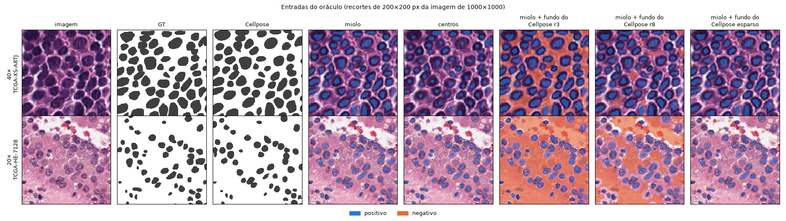
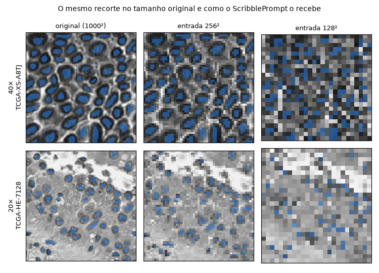
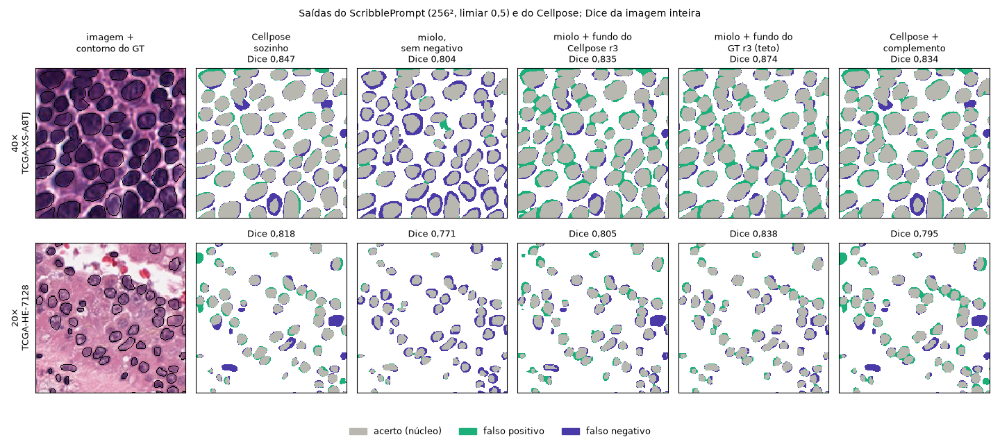

# 11 — Oráculos do ScribblePrompt: método, termos e resultados

> Rascunho para revisão do autor (2026-10-09). Escrito para servir de base à seção de método e de resultados do texto: cada
> termo é definido, cada número tem a origem marcada (✅ medido · 📖 artigo · ❓ inferência a confirmar).
> Pendências relacionadas: [PD-40](08-pendencias.md#pd-40) (teto da camada de segmentação), [PD-52](08-pendencias.md#pd-52)
> (o pipeline segmenta demais) e [PD-24](08-pendencias.md#pd-24) (imagens em 20×).

Um **oráculo** é um experimento sem rede treinada: a MarkerUNet é substituída por marcadores **conhecidos**, tirados do GT ou do
Cellpose, e só a camada de segmentação (o ScribblePrompt congelado) roda. Ele responde: *se a MarkerUNet acertasse um marcador
deste tipo, até onde o pipeline chegaria?* É um teto para o pipeline e um diagnóstico de onde ele perde.

Este documento descreve o oráculo **com negativo do Cellpose** (2026-10-08/09), feito com os dados atuais. O oráculo anterior
(2026-09-27, GT antigo, 30 imagens) está na PD-40 e no [03-modelos.md §8](03-modelos.md); os números dele não devem ser usados no
texto sem refazer.

---

## 1. Termos e unidades

| Termo | Significado |
|---|---|
| **px** | Pixel da imagem original. Toda imagem do MoNuSeg tem **1000 × 1000 px**. Quando um número vem em px sem outra indicação, é nessa escala. |
| **µm/px** | Micrômetros por pixel: o tamanho físico de um pixel. Cada XML do MoNuSeg informa esse valor no atributo `MicronsPerPixel` do cabeçalho. ✅ |
| **40× e 20×** | O aumento da objetiva com que a lâmina foi digitalizada. Em **40×**, ~0,25 µm/px (0,2456 a 0,2527 nas imagens com escala); em **20×**, 0,5005 µm/px. Com o dobro de µm por pixel, o mesmo tecido ocupa metade dos pixels em cada direção. No MoNuSeg, só três imagens de **treino** estão em 20×: `TCGA-HE-7128`, `-7129` e `-7130`. Quatro imagens de treino não informam a escala. ✅ (PD-24) |
| **Diâmetro do núcleo** | Diâmetro do círculo de mesma área que o polígono anotado. Mediana: **21,3 px** em 40× (≈ 5,3 µm) e **12,2 px** em 20× (≈ 6,1 µm). Fisicamente os núcleos têm o mesmo tamanho; só o número de pixels muda. ✅ (medido nos 51 XMLs) |
| **128², 256²** | Tamanho da **entrada do ScribblePrompt**: a imagem de 1000² e os *scribbles* são reduzidos para 128 × 128 ou 256 × 256 antes de entrar na rede, e a saída é ampliada de volta para 1000². O pacote foi treinado em 128² 📖; 256² usa os mesmos pesos (a rede é convolucional). A redução é bilinear e sem *antialias* (função `rescale_inputs` do pacote). ✅ |
| **Fator de redução** | 1000/256 ≈ 3,9 e 1000/128 ≈ 7,8. Um núcleo mediano de 40× vira **5,5 px** em 256² e **2,7 px** em 128²; um de 20× vira **3,1 px** e **1,6 px**. ✅ |
| **Marcador positivo** | Canal que diz à rede "aqui há objeto". Neste oráculo é binário (0/1). |
| **Canal negativo** | Canal que diz "aqui não há objeto". Também binário aqui. |
| **Dilatar por r px** | Fazer a máscara crescer r px para todos os lados: um pixel passa a pertencer à máscara se estiver a até r px (distância euclidiana) de algum pixel dela. Implementado como dilatação morfológica com um disco de raio r. ✅ |
| **Fundo do Cellpose r3 / r8** | Tudo o que está a **mais de 3 (ou 8) px** de qualquer núcleo achado pelo Cellpose, ou seja, o complemento da máscara do Cellpose dilatada por 3 (ou 8) px. Em volta de cada núcleo sobra uma **faixa livre** de 3 (ou 8) px sem positivo nem negativo, onde a rede decide sozinha. A faixa existe porque a borda do Cellpose não é exata: um negativo encostado na máscara cortaria a borda real do núcleo. |
| **Recorte r3 / r8** | Pós-processamento: a saída do ScribblePrompt é zerada em tudo o que está a mais de 3 (ou 8) px de qualquer núcleo do Cellpose. Usa a mesma máscara dilatada, mas na saída, não na entrada. |
| **Limiar de saída** | A rede devolve uma probabilidade por pixel; o pixel conta como núcleo se ela for ≥ limiar. O pipeline usa 0,5; aqui foram testados 0,5 a 0,9. |
| **Massa** | Pixels previstos como núcleo divididos pelos pixels de núcleo do GT: `(VP + FP) / (VP + FN)`. Maior que 1 = segmenta demais; menor que 1 = segmenta de menos. |
| **Miolo** | A parte interna de cada núcleo: os pixels cuja distância à borda é pelo menos metade da maior distância daquele núcleo. Ver §3.3. |

---

## 2. Pergunta

1. Com um marcador perfeito do tipo que a tese propõe (pequeno e interno), o ScribblePrompt alcança o Cellpose? (PD-40)
2. O pipeline treinado perde por excesso de segmentação (precisão 0,727 contra 0,867 do Cellpose; PD-52). Isso vem da camada de
   segmentação, que expandiria o marcador além da borda, ou de onde a MarkerUNet coloca o marcador?
3. Um canal negativo tirado do Cellpose (onde ele **não** achou núcleo) segura a segmentação? Ele é denso ou pode ser esparso?
4. As imagens em 20× são um problema da camada de segmentação? (PD-24)

---

## 3. Método

### 3.1 Dados ✅

- As **37 imagens de treino** do MoNuSeg, já pré-processadas (`data_source/MoNuSegPreprocessed/train`): GT novo, rasterizado pelo
  centro do pixel; Cellpose `cpsam` com diâmetro estimado por imagem e limiares padrão; mapa de distância por núcleo.
- O **teste não é usado**: a escolha de configuração não pode ver o teste (PD-02).
- **Linha de base:** o Cellpose sozinho nas mesmas imagens, com **Dice 0,845**, precisão 0,867, revocação 0,826 e massa 0,955.

### 3.2 Como o ScribblePrompt recebe os prompts ✅

A rede recebe 5 canais: `[imagem, caixa, positivo, negativo, máscara anterior]`. Aqui, caixa e máscara anterior são zero (uma
única interação), e a imagem vai em tons de cinza (`0,299 R + 0,587 G + 0,114 B`, dividida por 255). Os cinco canais são
reduzidos juntos para 128² ou 256². A saída (logits) é ampliada para 1000² e passa por uma sigmoide. O código é o mesmo do
pipeline (`ScribblePromptingNetwork`); os canais positivo e negativo são montados à mão e entregues diretamente.

### 3.3 Marcadores positivos ✅

O mapa de distância por núcleo vale 0 no ponto mais interno de cada núcleo e 1 na borda (`1 − EDT/máx EDT do núcleo`).

| Nome | Definição | Área média (da imagem) |
|---|---|---|
| `gt` | O GT inteiro. | 24,4% |
| `miolo` | Pixels de núcleo com mapa de distância ≤ 0,5. | 8,4% (≈ 34% do GT) |
| `centros` | Disco de raio 4 px em torno dos pixels de mapa 0 de cada núcleo, cortado pelo GT. | 3,8% |
| `cellpose` | A máscara do Cellpose. | 23,2% |
| `cellpose_miolo` | O miolo de cada instância do Cellpose (mesma regra do `miolo`). **Não usa o GT**: uma linha de base sem treino. | 8,0% |

### 3.4 Canais negativos ✅

| Nome | Definição | Área média (da imagem) |
|---|---|---|
| `zero` | Nenhum negativo. É o que o pipeline usa hoje (modo `positive`). | 0% |
| `complemento` | Tudo o que não é positivo (`1 − positivo`). É o negativo denso do modo `sharpened`. | 76–96% (depende do positivo) |
| `cp_fundo_r3` | Fundo do Cellpose r3 (§1). | 64,9% |
| `cp_fundo_r8` | Fundo do Cellpose r8. | 46,4% |
| `cp_fundo_esparso` | Discos de raio 3 px numa grade de 25 px, mantidos só onde `cp_fundo_r8` vale 1. Imita cliques negativos espalhados. | 2,1% |
| `gt_fundo_r3` | Fundo do **GT** r3: o negativo "perfeito", usado como teto. | 63,0% |

### 3.5 Grade e pós-processamento ✅

5 positivos × 6 negativos × 2 resoluções (128², 256²) = 60 passadas da rede por imagem. Cada saída é avaliada com 5 limiares
(0,5 a 0,9) e 3 recortes (nenhum, r3, r8): 900 linhas por imagem e **33.300 linhas** no total.

### 3.6 Métricas ✅

Por imagem, pixel a pixel, com a função `binary_metrics` do projeto: Dice `2VP / (2VP + FP + FN)`, precisão `VP / (VP + FP)`,
revocação `VP / (VP + FN)` e massa (§1). Cada configuração é resumida pela **média por imagem**, pela diferença pareada contra o
Cellpose e pelo número de imagens (de 37) em que ela supera o Cellpose.

### 3.7 Reprodução ✅

- Notebook: [oraculo_negativo.ipynb](../../notebooks/exploration/oraculo_negativo.ipynb).
- Resultados: `docs/estudo/resultados/oraculo_negativo/`, com `por_imagem.csv.gz`, `resumo.csv`, `config.json` (grade, commit
  `d90ce99`, versões, SHA-256 do checkpoint) e as três figuras.
- A execução salva é a do Colab (T4, ~9 min, 2026-10-09). Uma execução independente em CPU (~19 min, 2026-10-08) deu as mesmas
  33.300 linhas, com diferença máxima de 2·10⁻⁵ no Dice.

---

## 4. Resultados

### 4.1 Tabela principal (256²) ✅

Dice médio no treino com o **melhor limiar e o melhor recorte** de cada célula. Entre parênteses, as imagens (de 37) em que a
configuração supera o Cellpose (0,845).

| Positivo | zero | fundo Cellpose r3 | r8 | r8 esparso | complemento | fundo GT r3 (teto) |
|---|---|---|---|---|---|---|
| GT inteiro | 0,915 (37) | 0,878 (34) | 0,876 (35) | 0,870 (29) | **0,944** (37) | 0,935 (37) |
| miolo | 0,754 (2) | **0,820** (2) | 0,791 (0) | 0,768 (0) | 0,561 (0) | 0,870 (29) |
| centros | 0,542 (0) | **0,786** (0) | 0,716 (0) | 0,690 (0) | 0,306 (0) | 0,830 (18) |
| máscara do Cellpose | 0,826 (0) | 0,832 (6) | 0,824 (2) | 0,822 (0) | **0,837** (5) | 0,879 (35) |
| miolo do Cellpose | 0,683 (0) | **0,797** (0) | 0,762 (0) | 0,741 (0) | 0,514 (0) | 0,838 (17) |

O melhor limiar foi 0,5 para todos os marcadores pequenos e 0,5–0,8 para os grandes (GT inteiro e máscara do Cellpose). Como limiar e recorte foram escolhidos nas
mesmas 37 imagens, os valores são levemente otimistas.

### 4.2 Precisão, revocação e massa (256², limiar 0,5, sem recorte) ✅

| Positivo + negativo | Dice | Precisão | Revocação | Massa |
|---|---|---|---|---|
| miolo + zero | 0,754 | 0,963 | 0,622 | **0,65** |
| miolo + fundo Cellpose r3 | 0,820 | 0,858 | 0,792 | 0,93 |
| miolo + fundo Cellpose esparso | 0,592 | 0,555 | 0,767 | **1,95** |
| miolo + fundo GT r3 | 0,870 | 0,899 | 0,848 | 0,95 |
| GT inteiro + zero | 0,839 | 0,725 | 0,997 | **1,38** |
| Cellpose sozinho (referência) | 0,845 | 0,867 | 0,826 | 0,96 |

Sem negativo, o efeito do limiar depende do tamanho do marcador. No GT inteiro, subir de 0,5 para 0,8 leva o Dice de 0,839 a
0,915 (massa 1,38 → 1,08). No miolo, o leva de 0,754 a 0,564 (massa 0,65 → 0,40).

### 4.3 Resolução e imagens em 20× ✅

Em 128², todas as configurações ficam abaixo de 256². No miolo com o fundo do Cellpose r3, por exemplo, o Dice vai de 0,820
para 0,761 (em 128², r3 e r8 empatam).

| Configuração (miolo, limiar 0,5) | outras 34 imagens (40× ou sem escala) | 20× (3 imagens) |
|---|---|---|
| Cellpose sozinho | 0,846 | 0,836 |
| 256², sem negativo | 0,751 | 0,788 |
| 256², fundo Cellpose r3 | 0,820 | 0,823 |
| 128², sem negativo | 0,677 | **0,542** |
| 128², fundo Cellpose r3 | 0,770 | **0,659** |

### 4.4 Figuras ✅

As três figuras usam dois recortes de 200 × 200 px: um de `TCGA-XS-A8TJ` (40×, a imagem com o Dice do Cellpose mais perto da
mediana das 34 imagens que não estão em 20×) e um de `TCGA-HE-7128` (20×). Em cada imagem, o recorte é a janela com mais núcleo numa grade de
100 px.

**Figura 1 — entradas.** O GT, o Cellpose, os positivos (azul) e os negativos (laranja). A faixa sem cor entre o azul e o laranja
é a faixa livre de 3 ou 8 px.

**Figura 2 — resolução.** A imagem em tons de cinza com o miolo, como o ScribblePrompt as recebe. O recorte de 200 px vira 51 px
em 256² e 26 px em 128². Em 128², os núcleos de 20× ficam com 1–2 px.

**Figura 3 — saídas** (256², limiar 0,5, sem recorte). Acerto em cinza, falso positivo em verde-água, falso negativo em violeta;
o Dice é o da imagem inteira. Sem negativo, o miolo deixa a borda dos núcleos de fora (anel violeta). Com o fundo do Cellpose, a
borda volta, com algum excesso (verde).

---

## 5. Leituras

1. **Nenhum marcador pequeno alcança o Cellpose com o ScribblePrompt, nem perfeito.** ✅ O melhor é o miolo com o fundo do
   Cellpose: 0,820, superando o Cellpose em 2 de 37 imagens. Isso responde a pergunta 1 e mantém a PD-40.
2. **Sem negativo, um marcador pequeno bem colocado sub-segmenta; ele não vaza.** ✅ O miolo tem quase a mesma área dos marcadores
   do `base_dice_tv` (8,4% contra 9,0%), mas dá massa 0,65 e precisão 0,963. O pipeline treinado dá massa 1,17 e precisão 0,727.
   ❓ Então o excesso do pipeline vem de **onde** a MarkerUNet põe o marcador (fundo, entre núcleos), e não de a camada expandir
   um marcador correto (pergunta 2, PD-52). Para confirmar, falta ver os marcadores aprendidos.
3. **O negativo do Cellpose ajuda muito os marcadores pequenos, mas prende o resultado ao Cellpose.** ✅ O miolo sobe de 0,754
   para 0,820, e os centros de 0,542 para 0,786. Mas nenhuma configuração que só usa informação do Cellpose passa dele (a melhor
   dá 0,837), e com o GT inteiro o negativo do Cellpose **piora** (0,915 → 0,878), porque corta núcleos que o Cellpose não achou.
   ❓ Com esse negativo, o teto do pipeline tende a ser o próprio Cellpose.
4. **A qualidade do negativo vale mais que a do positivo.** ✅ Com o fundo do GT, o miolo passa do Cellpose (0,870, 29/37) e os
   centros chegam perto (0,830). O negativo carrega a informação de borda que um marcador pequeno não tem.
5. **Negativo esparso piora.** ✅ Pontos negativos espalhados fazem a rede segmentar o dobro do GT (massa 1,95), pior do que
   nenhum negativo. ❓ Fora da distribuição de treino do ScribblePrompt (cliques negativos isolados, sem traço)?
6. **Em 256², as imagens em 20× não são problema da camada de segmentação.** ✅ Elas só perdem em 128², onde um núcleo vira
   ~1,6 px (pergunta 4, PD-24). Com o diâmetro estimado por imagem, o Cellpose também quase não perde nelas (0,836 contra 0,846).

---

## 6. Ressalvas (para a seção de limitações)

- Os marcadores e negativos são **binários**; a MarkerUNet produz valores contínuos, e o modo `positive` os transforma em
  `relu(s − 0,5)/0,5`. Um marcador aprendido pode se comportar diferente de um binário de mesma área.
- **Uma única interação**, sem a máscara anterior como entrada. O ScribblePrompt foi treinado com interações sucessivas 📖.
- Limiar e recorte foram escolhidos nas mesmas imagens em que são medidos (§4.1). O efeito é pequeno, porque são só 15
  combinações por célula, mas existe.
- O GT é **semântico** (binário): núcleos colados viram uma região só nas métricas, embora miolo e centros sejam calculados
  **por núcleo**.
- Só as 37 imagens de treino. As três imagens em 20× são uma amostra pequena.

---

## 7. Dúvidas para validar

1. O raio 3 px da faixa livre foi escolhido a dedo (≈ 1/7 do diâmetro de um núcleo de 40×). Vale testar 1–2 px, ou um raio
   proporcional ao diâmetro de cada imagem?
2. Este documento deve absorver o oráculo antigo (03 §8 e PD-40), refeito com os dados atuais, para ficar como o único registro
   de oráculos?
3. A Figura 3 serve para o texto, ou prefere outra imagem ou recorte?

---

## Decisões

| Data | Decisão | Origem |
|---|---|---|
| | | |
